# Procesverslag
**Auteur:** -Sena Nur Korkutan-

**De opdrachten:** [opdracht 1](opdracht1/index.html) en [opdracht 2](opdracht2/index.html)

Markdown is een simpele manier om HTML te schrijven.  
Markdown cheat cheet: [Hulp bij het schrijven van Markdown](https://github.com/adam-p/markdown-here/wiki/Markdown-Cheatsheet).

Nb. De standaardstructuur en de spartaanse opmaak van de README.md zijn helemaal prima. Het gaat om de inhoud van je procesverslag. Besteedt de tijd voor pracht en praal aan je website.

Nb. Door *open* toe te voegen aan een *details* element kun je deze standaard open zetten. Fijn om dat steeds voor de relevante stuk(ken) te doen.

## Bronnenlijst

### Opdracht 1 
  1. [Figma logo size css](https://codepen.io/moshfequr9/pen/ZjyeZj)
  2. [Figma trademark guideline](https://www.figma.com/using-the-figmabrand/#:~:text=Figma%20Marks&text=For%20instance%2C%20the%20name%20and,of%20our%20most%20important%20assets.)
  3. [Whyte Intrap font](https://fontshub.pro/font/whyte-inktrap-download)
  4. [Hide an element](https://stackoverflow.com/questions/21993661/css-auto-hide-elements-after-5-seconds)
  5. [Transform property](https://developer.mozilla.org/en-US/docs/Web/CSS/transform)
  6. [Shadow to an ::after || :: before element](https://stackoverflow.com/questions/28033616/adding-box-shadow-to-a-after-pseudo-element)
  7. [Gradient generator](https://cssgradient.io/)
  8. [Prefers Reduced Motion](https://web.dev/prefers-reduced-motion/#:~:text=The%20media%20query%20prefers%2Dreduced,in%20the%20underlying%20operating%20system.)

### Opdracht 2 
  1. [Cursor](https://developer.mozilla.org/en-US/docs/Web/CSS/cursor)
  2. [Flexbox css-tricks](https://css-tricks.com/snippets/css/a-guide-to-flexbox/)
  3. [My old css codes](https://github.com/Sensinki?tab=repositories)
  4. [Scroll](https://codepen.io/shooft/pen/eYLGWMB?editors=0110)
  5. [Inspiration](https://www.sinds1971.nl/fvd/bewegen/)
  6. [chatGPT](https://openai.com/blog/chatgpt)

## Opdracht 1 plan

  
uitwerken na schetsen idee (voor week 2)

  ### Je storyboard:
  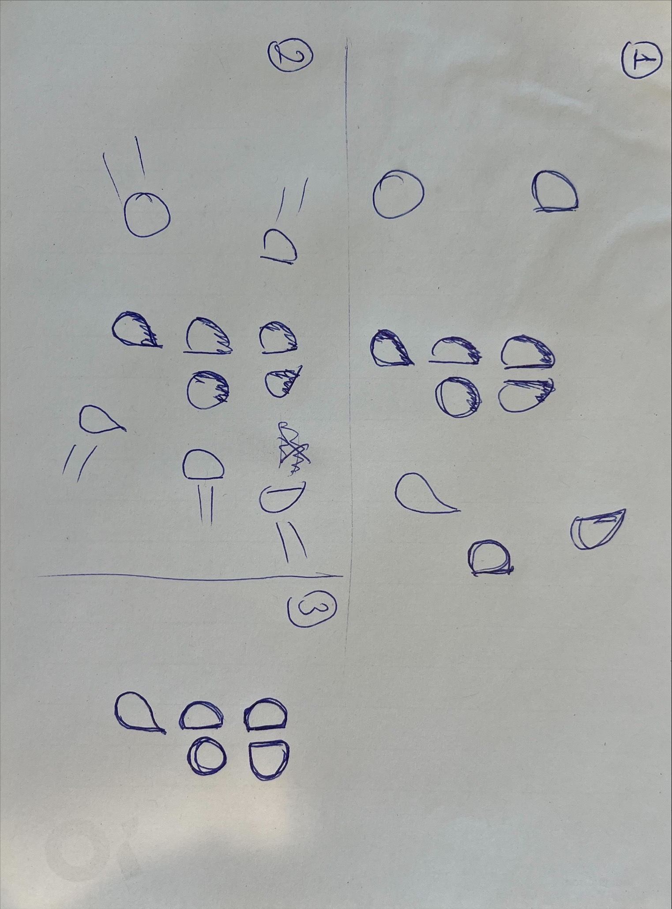

  ### Je ambitie: 
  Aan deze technieken/punten wil ik werken:
  - Professionele animaties kunnen maken
  - Gemakkelijk te spelen met de elementen
  - Dark mode aanpassen
  - Proberen responsieve schermen te maken

 

## Opdracht 1 reflectie

  
uitwerken bij afronden opdracht (voor week 4)

  ### Je uitkomst - karakteristiek screenshot(s):
  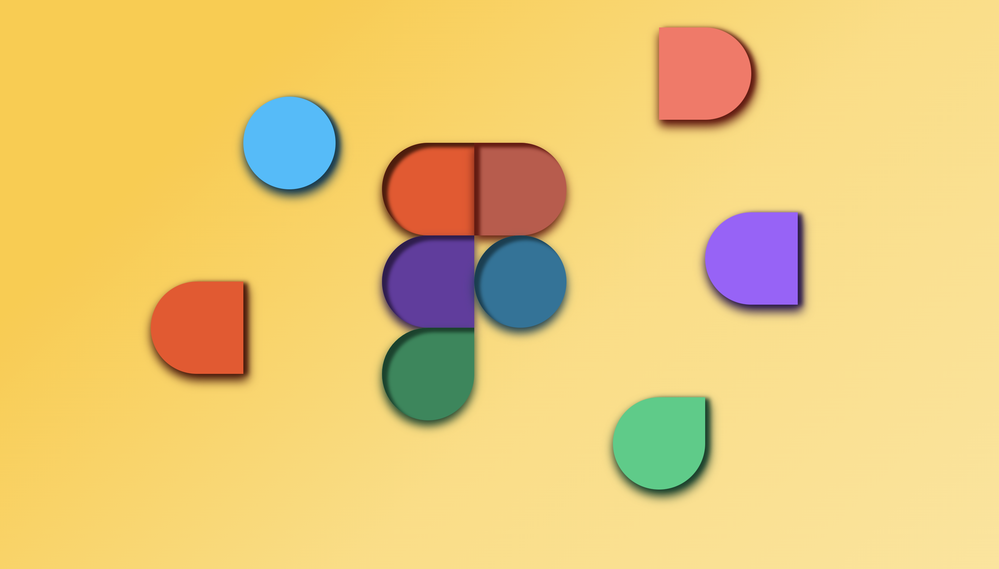
  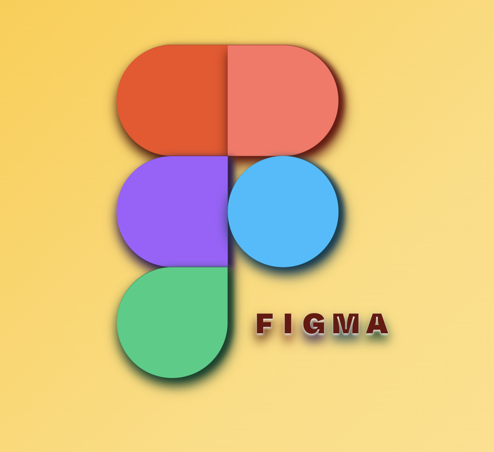
  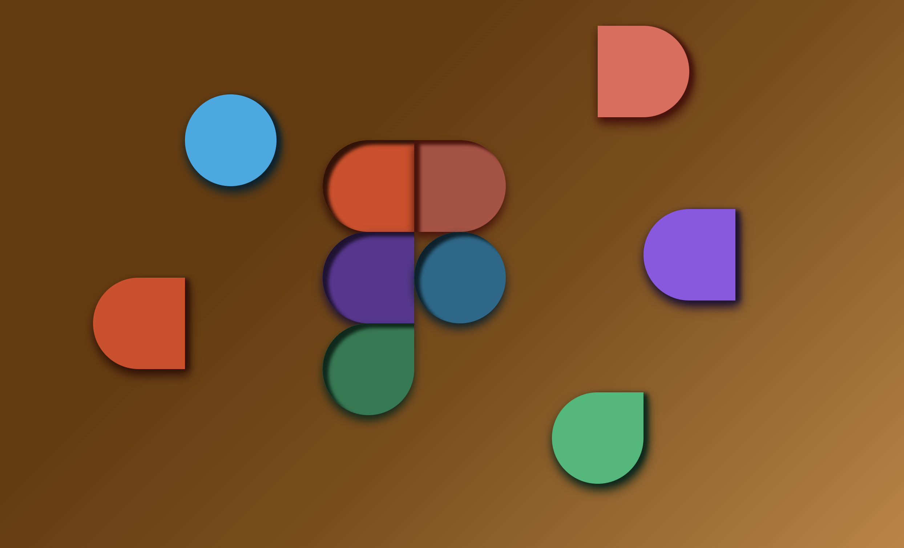
  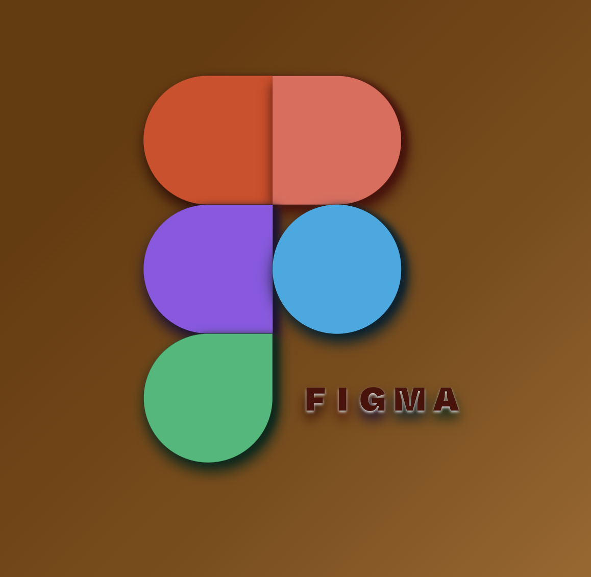

  ### Dit ging goed/Heb ik geleerd:
  
  - Custom properties
  - Dark/light-mode ging gewoon goed.
  - Reduced motion was makkelijker dan ik dacht
  - @font-face lijkt me heel makkelijk 
  - 2 animatie maken in een @keyframe
  - Manipuleren van ::after en ::before was makkelijker dan ik dacht
  - Elementen hidden krijgen
  - Verschillende shadow opties

  
  

  ### Dit was lastig/Is niet gelukt:
  
  - Kleuren zijn erg belangrijk voor contrast, er waren te veel kleuren waardoor het moeilijk was om contrast aan te brengen
  - Ik vind gebruiken van de z-index property lastig. Elementen die op de grond moet blijven zijn niet op de ground, andere elementen komen vóór het elemnt, zoals in de foto te zien.
  - Heel veel rekening heb ik gedaan tijdens procenten deel van de animaties
  
  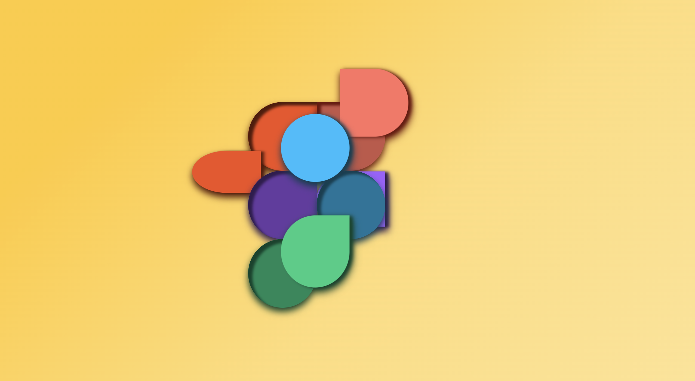

## Opdracht 2 plan

  
uitwerken na schetsen idee (voor week 5)

  ### Je ontwerp:
  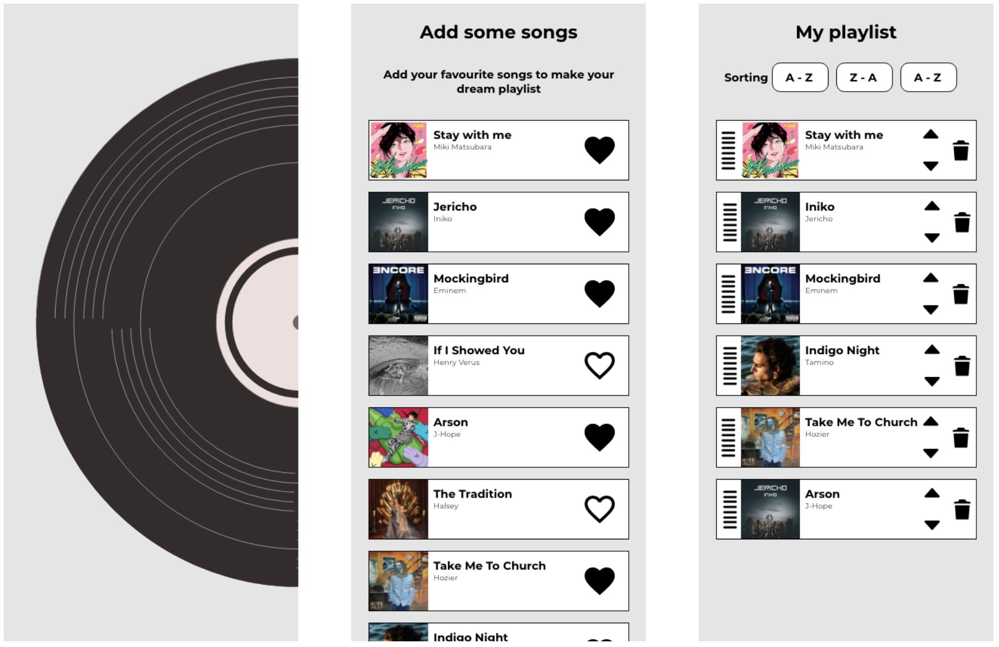

  ### Je ambitie: 
  Aan deze technieken/punten wil ik werken:
  - Items sorteren
  - Items zoeken
  - Gemakkelijk te spelen met de elementen
  - Dark mode aanpassen
  - Zoveel mogelijk responsieve schermen te maken

## Opdracht 2 test

  
uitwerken na testen (week 7)

  Neem minimaal 5 bevindingen op:
  

  ### Bevinding 1:
  Ik dacht dat ik een database moest gebruiken. 
  
  #### oplossing:
  Later heb ik geleerd dat er een local storage is en het gebruiken van hem is niet moeilijker dan ik dacht.

  ### Bevinding 2:
  Ik had geen idee hoe ik songs in mijn html kon krijgen. Ik heb js gebruikt om elementen te maken binnen het ul element hieronder. 

  #### oplossing:
    <ul id="likedSongsList">
      <!-- Liked songs will be added dynamically here from liked-songs.js-->
    </ul>

  ### Bevinding 3:
  Ik dacht altijd dat chatGPT niet echt hielp om dingen beter te begrijpen.
  
  #### oplossing:
  Ik heb nu ontdekt dat ik de juiste vragen moet stellen als ik nuttige informatie wil. Ik heb bijvoorbeeld het idee van lokale opslag van chatCPT gekregen.

  ### Bevinding 4:
  Het liken en zien van hetzelfde liedje op een andere pagina was moeilijker dan ik dacht. Ik had veel tijd besteed aan die like-functie.
  
  #### oplossing:
      document.addEventListener("DOMContentLoaded", function () {
          const likeHearts = document.querySelectorAll(".like");
      
          likeHearts.forEach(function (heart) {
              heart.addEventListener("click", function () {
                  heart.classList.toggle("liked");
      
                  if (heart.classList.contains("liked")) {
                      heart.setAttribute("src", "images/heart-filled.png");
                      heart.setAttribute("alt", "heart-filled");
                  } else {
                      heart.setAttribute("src", "images/heart.png");
                      heart.setAttribute("alt", "heart");
                  }
      
                  const songTitle = heart.parentNode.querySelector("h2").innerText;
                  const artistName = heart.parentNode.querySelector("h3").innerText;
      
                  let likedSongs = localStorage.getItem("likedSongs");
                  if (!likedSongs) {
                      likedSongs = [songTitle];
                  } else {
                      likedSongs = JSON.parse(likedSongs);
                      likedSongs.push(songTitle);
                  }
      
                  localStorage.setItem("likedSongs", JSON.stringify(likedSongs));
              });
          });
      });

  Na het like effect werkt, heb ik local storage gebruiktom op te slagen.

  ### Bevinding 5:
  Bij sorteren was ik niet zeker hoe het te doen, Sanne's code helpt mij om deze probleem op te losssen.
  #### oplossing:
  Ik vond een library en gebruikte die om sorteerknoppen werkend te krijgen.
  
      

  

## Opdracht 2 reflectie

  
uitwerken bij afronden opdracht (voor week 8)

  ### Je uitkomst - karakteristiek screenshot(s):
  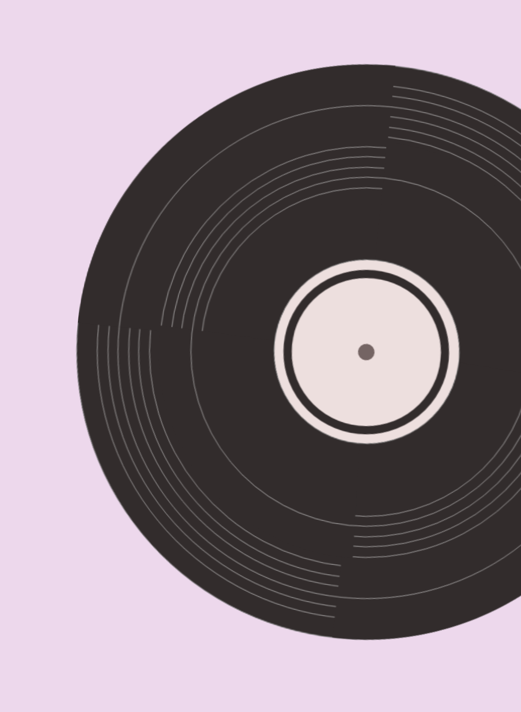
  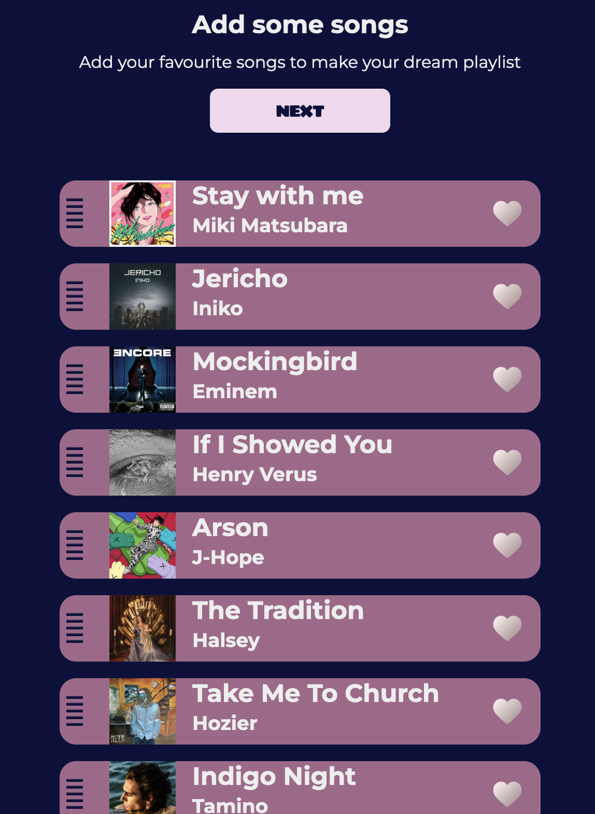
  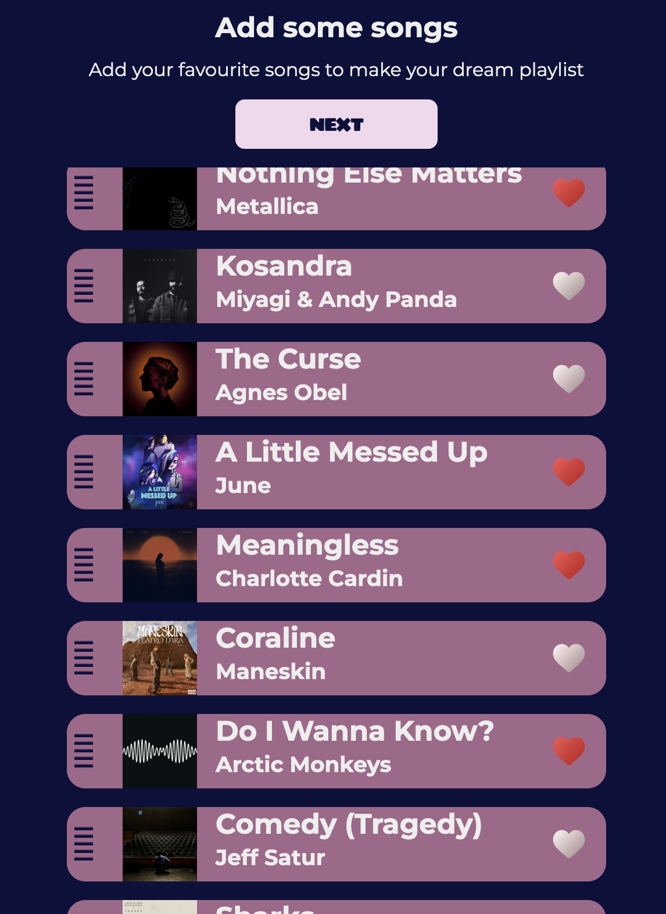
  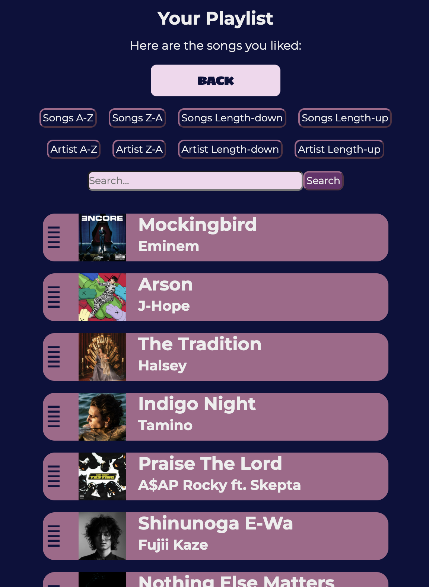
  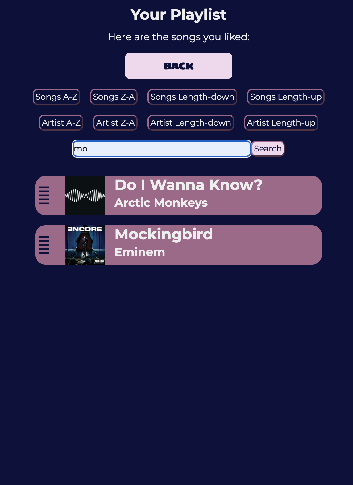
  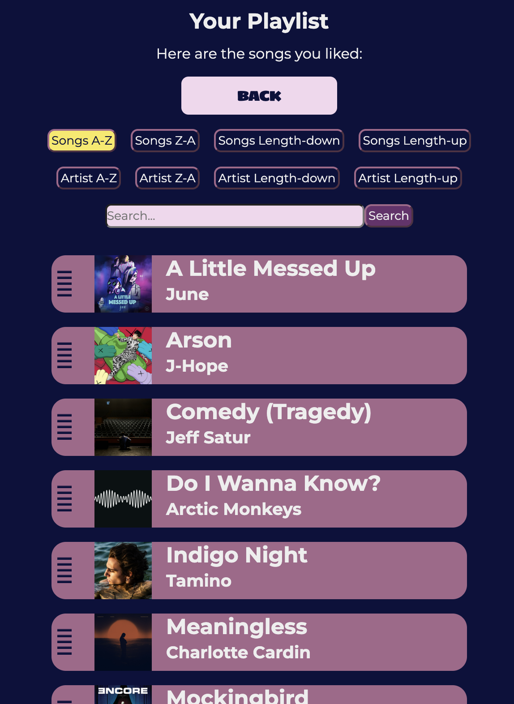

  ### Dit ging goed/Heb ik geleerd: 
  
  - Custom properties
  - Dark/light-mode ging gewoon goed.
  - Reduced motion was makkelijker dan ik dacht
  - Makkelijk animaties schrijven met @keyframe
  - Manipuleren van ::after en ::before was makkelijker dan ik dacht
  - Items sorteren
  - Drag en drop effect
  - Items liken en gebruiken in andere pagina
  - Keyboard functies gebruiken
  - Local storage
  - Search functie
  - Loading animation

  ### Dit was lastig/Is niet gelukt:
  - Wanneer ik weer een nieuw item wil toevoegen aan de locale storage, verdwijnen de items die ik eerder heb toegevoegd. Ik vond het moeilijk om dit probleem op te lossen, dus uiteindelijk besloot ik om het niet toe te voegen.

